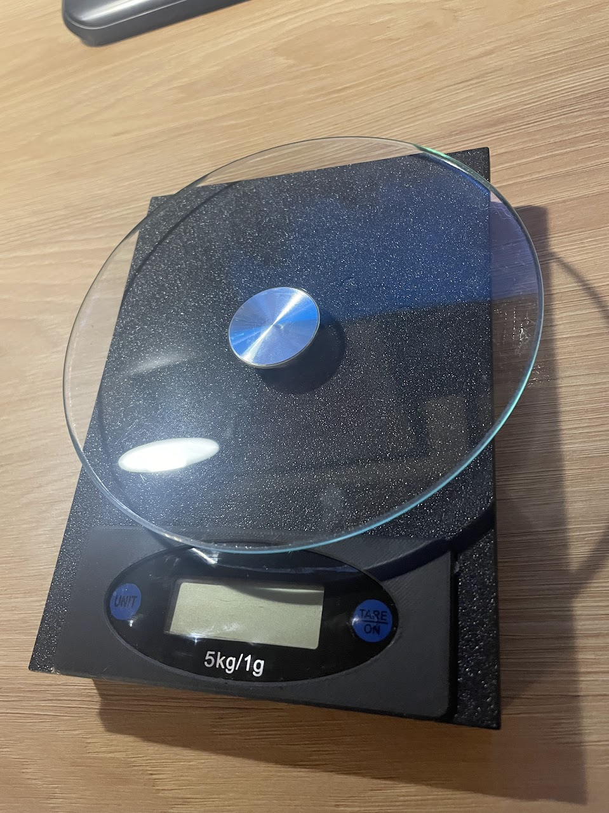
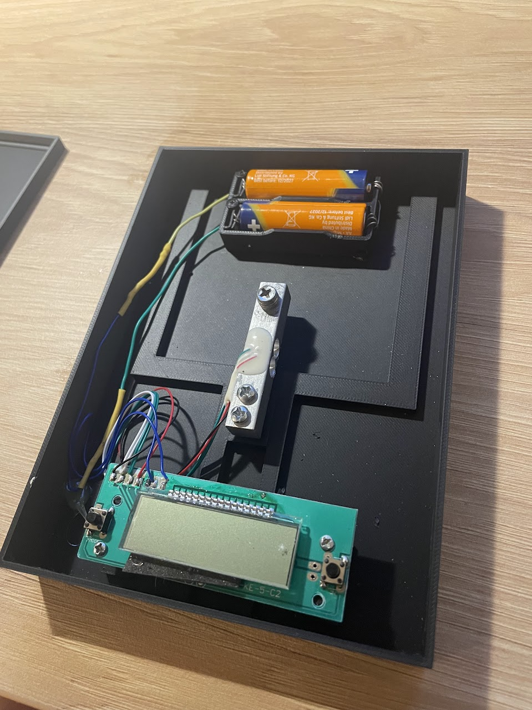
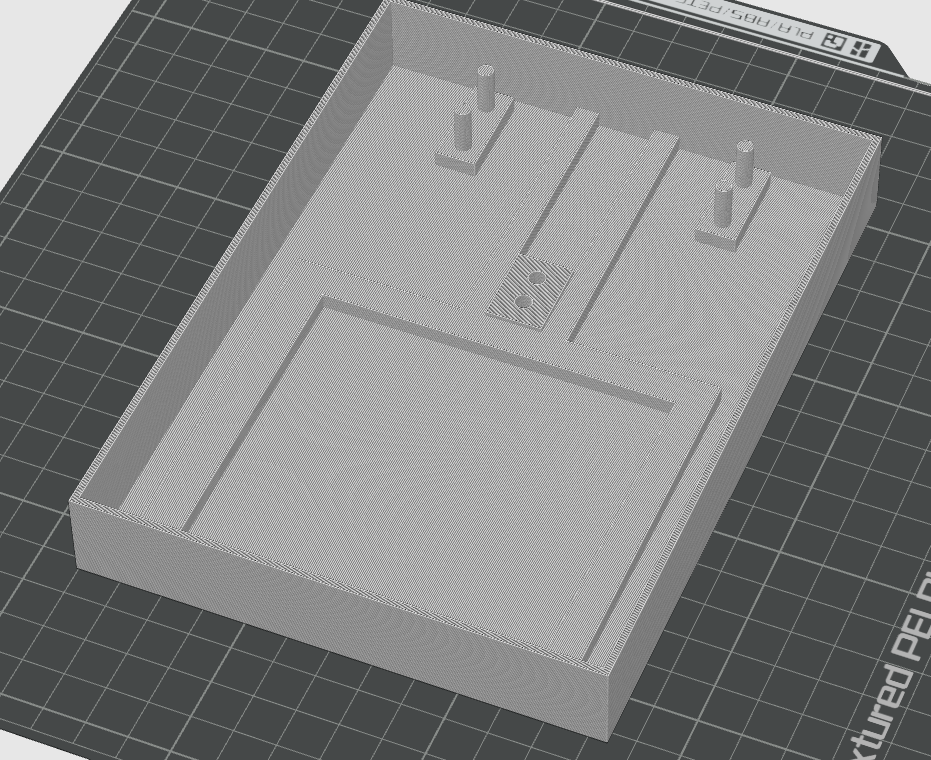
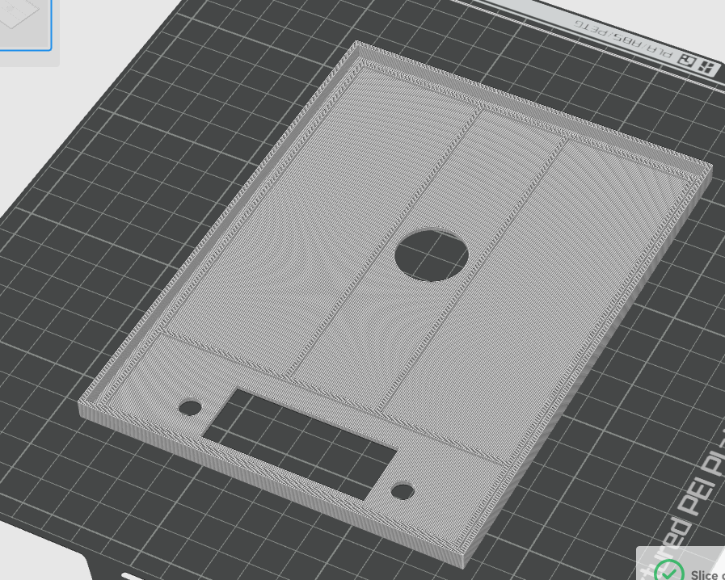
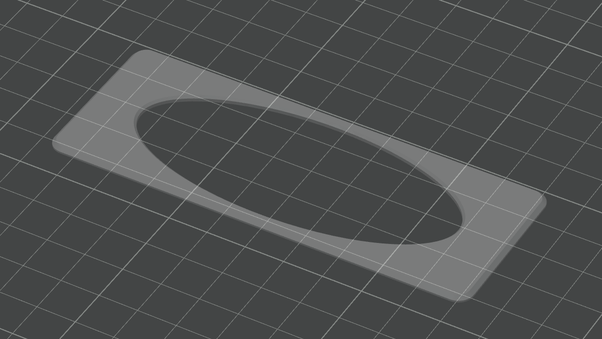
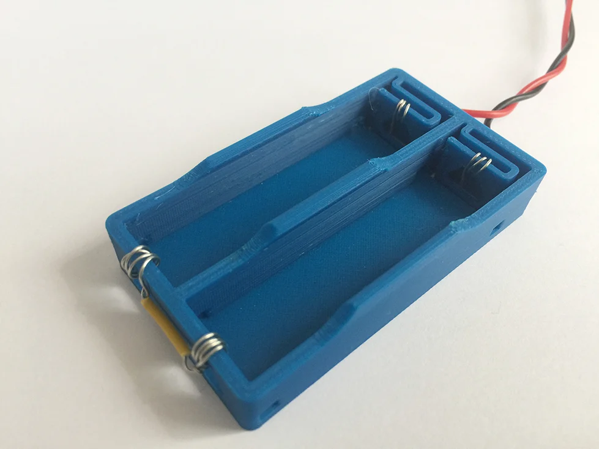

# 3D Printed Kitchen Scale Enclosure

This project breathes new life into an old, cheap kitchen scale. Instead of throwing it away when the original casing broke, I salvaged the internal electronics (load cell, main PCB, and glass plate) and designed a custom 3D-printed enclosure to make it fully functional again.

 
*The final assembled kitchen scale with the salvaged glass top.*

 
*Inside view showing the mounted load cell, PCB, and wiring.*

---

## 3D Models

All custom parts were designed to fit the salvaged electronics perfectly.

* **[housing-bottom.stl](housing-bottom.stl)** 
   
  The base element of the scale. It includes dedicated mounting points and standoffs for the load cell (weight sensor) and the main electronic board.

* **[housing-top.stl](housing-top.stl)** 
   
  The top cover featuring precise cutouts for the LCD screen and physical buttons. It also has a central hole allowing the load cell to connect to the external glass plate.

* **[display-frame.stl](display-frame.stl)** 
   
  A finishing bezel/frame designed to neatly cover the raw edges around the display and buttons, giving the scale a much cleaner look.

### Third-Party Components

* **[AA Battery Holder](https://www.thingiverse.com/thing:2339441)** 
   
  *Note: This is not my design.* I used an excellent existing AA battery basket model from Thingiverse to power the electronics. To mount it, I simply glued the printed holder directly to the bottom housing.